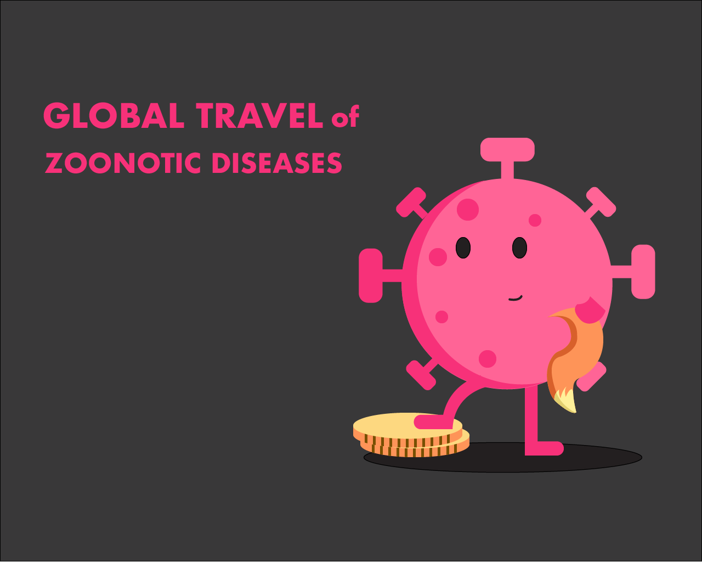
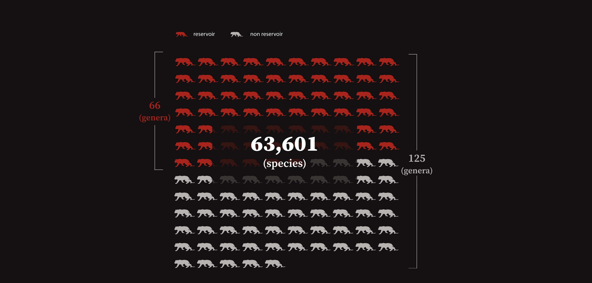
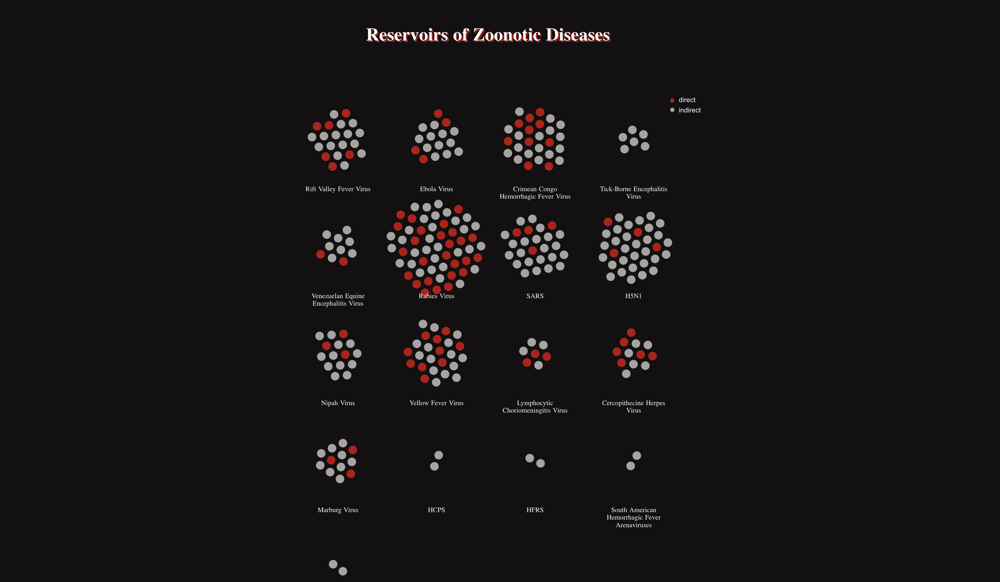
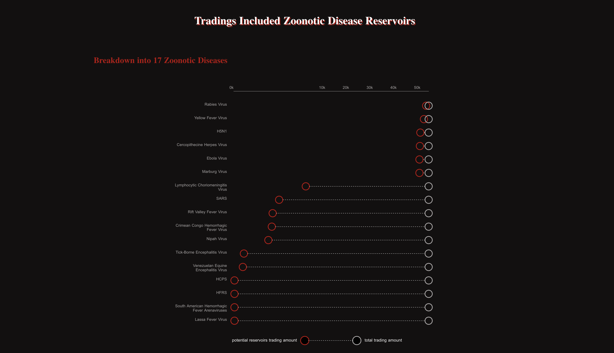
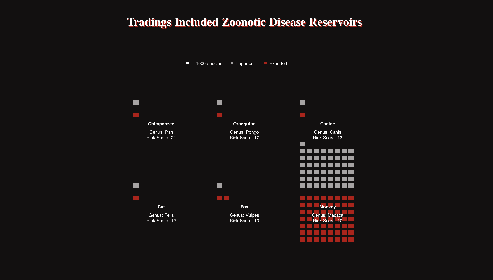

# Global Journey of Zoonotic Diseases
An analysis of how global wildlife trading is related to the zoonotic diseases.

[Project Website](https://yiranni.github.io/master-thesis/#/)

## Abstract
The Covid-19 outbreak has been identified by the World Health Organization as a “Public Health Emergency of International Concern”. Even though investigations on how the virus spread to humans and which animals transferred the virus to humans are still ongoing, the epidemic might have started from a seafood market in Wuhan, China where also sells wildlife animals meat and live animals. The exact origins of COVID-19 are still unknown, but it is suspected to have originated in bats and may have jumped to humans via an intermediary wildlife animal species.

The outbreak of COVID-19 brought the term "zoonotic disease" to the public. Zoonotic diseases are illnesses caused by germs that are passed between animals and human with non-human animal origin. Zoonotic diseases are much more common than people may realize: within hundreds of emerging infectious diseases (EIDs) reported since 1940, 60.3% of EID events are caused by zoonotic pathogens.

This project analyzes how internatial wildlife trading could transmit zoonotic diseases by dissecting annual mammals international tradings and tradings involved potential virus reservoirs of 17 zoonotic diseases.

## Data Sources
- [CITES Trade Database](https://trade.cites.org/)
- [Zoonotic Diseases Capability of Infecting Mammals](https://www.ncbi.nlm.nih.gov/pmc/articles/PMC2857234/)

## Framework
- Nuxt
- Vue.js

## Data Visualization Library
- D3.js

## Visualizations
Total mammals traded Vs. Mammals that are virus reservoirs

17 zoonotic diseases & Genus identified as reservoirs

Number of mammals traded identified as reservoir of each zoonotic disease

Risk Assessment & Top 6 Risky Mammals

## Future Development

- Mobile-friendly version

- Implement illegal animal trading data. Current data provided by [CITES](https://trade.cites.org/) only includes legal trading reported by CITES Parties. The data would not be very accurate if not including illegal trading data.

## Acknowledgement
This project was completed as part of the 2020 Masters in Data Visualization program at Parsons School of Design, NYC. 

You can view all of our projects [here](https://parsons.nyc/thesis-2020/).

Special thanks to Parsons MSDV faculty, especially [Daniel Sauter](https://github.com/danielsauter) and [Aaron Hill](https://github.com/aaronxhill).
